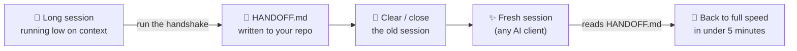

<div align="center">

<picture>
  <source media="(prefers-color-scheme: dark)" srcset="assets/logo-dark.svg">
  
</picture>

# Session Handshake

### Hand off a long AI session to a fresh one — on *any* client — without losing a thing.

[](LICENSE)
[](#-contributing)
[](https://github.com/SathiaAI/Session-Handshake/stargazers)


**[⬇️ Install to Cowork](#-install-to-cowork-cloud) · [⚡ Quick Start](#-quick-start) · [🔁 How it works](#-how-it-works) · [📄 The handoff](#-what-the-handoff-contains)**

</div>

---

When your context window gets heavy, you shouldn't have to start over. **Session Handshake** turns the dying session into a single `HANDOFF.md` — an engineering-grade briefing (not a chat summary) that a brand-new session reads and instantly continues from. The next session can even be a *different AI*: **Claude, Cursor, Codex, Grok, Grokbot, Gemini, Facebook Muse**, or anything else.

> **One brain, many light switches.** A `SKILL.md` is Claude-only, but a `HANDOFF.md` is plain markdown every AI can read. So this repo ships one generator prompt plus thin per-client triggers — install the trigger for your tool, get the same portable handoff everywhere.

## 🔁 How it works



## ⚡ Quick start

**1. Install the trigger for your client:**

| Client | How to install | Effort |
|---|---|---|
| **Claude Code** (local) | `npx skills add SathiaAI/Session-Handshake` | ✅ One command |
| **Claude Cowork / claude.ai** (cloud) | Upload the zip — [see below](#-install-to-cowork-cloud) | 📤 One upload |
| **Cursor** | Drop a rule into `.cursor/rules/` — [`clients/cursor.md`](clients/cursor.md) | ⚡ Copy one file |
| **Codex** (& AGENTS.md tools) | Add a section to `AGENTS.md` — [`clients/codex-agents.md`](clients/codex-agents.md) | ⚡ Copy one section |
| **Grok / Gemini / Muse / any** | Paste a prompt — [`clients/universal-paste.md`](clients/universal-paste.md) | 📋 Paste |

**2. When context gets heavy, trigger it:**

> Run the session handshake.

**3. Clear the old session, open a fresh one, and say:**

> Read HANDOFF.md and confirm you're ready to continue.

That's the handshake. Done. ✅

## ☁️ Install to Cowork (cloud)

`npx skills add` installs to **local** agents only — it does **not** reach Cowork cloud sessions. Cowork reads from your **claude.ai account skill library**, so add it there once:

1. Download **[`dist/session-handshake.zip`](dist/session-handshake.zip)** (pre-packaged with the skill folder as the zip's root — exactly what claude.ai's uploader expects).
2. In claude.ai → **Customize → Skills → Add** → upload the zip.
3. It now auto-loads in **every** Cowork session. No per-session setup.

Full detail: [`clients/claude.md`](clients/claude.md).

## 📄 What the handoff contains

Nine sections, engineered so the next session doesn't waste your time:

| # | Section | Why it matters |
|---|---|---|
| 1 | **Mission** | What we're building/fixing and why — in plain English |
| 2 | **Current State** | Working / half-built / blocked + the exact next action |
| 3 | **Decisions Made (and Why)** | The single biggest win — the next session won't re-litigate settled calls |
| 4 | **Architecture & Key Files** | What exists, why, and what to leave alone |
| 5 | **Gotchas & Hard-Won Knowledge** | The footguns, so they aren't stepped on twice |
| 6 | **Conventions In Play** | How we work, and what we're deliberately *not* doing yet |
| 7 | **Open Questions** | Clear questions for you — not vague topics |
| 8 | **Do Not Touch** | Settled things the next session shouldn't "helpfully" refactor |
| 9 | **Resume Command** | Copy-paste to start the next session instantly |

Every generated file opens with a **portability header** that tells the receiving session — on any tool — exactly how to behave: read fully, confirm readiness, don't re-litigate, and trust the real project state over the document if they ever disagree.

## 🆚 Why not just `/compact`?

| | Auto-compact / summary | Session Handshake |
|---|---|---|
| Fires when | Arbitrary point (often mid-task) | **You choose** — at a logical boundary |
| Keeps the *why* behind decisions | Rarely | ✅ A whole section for it |
| Portable to another AI client | ❌ | ✅ Plain markdown + portability header |
| Grounded in real file/repo state | ❌ | ✅ Inspects real state, cites commits |
| Survives closing the session | ❌ | ✅ It's a file on disk |

## 📦 What's in the box

```
Session-Handshake/
├── HANDSHAKE.md                     # 🧠 the universal generator prompt (paste-anywhere core)
├── templates/HANDOFF.template.md    # the 9-section output skeleton it produces
├── skills/session-handshake/SKILL.md# Claude / Cowork / Claude Code auto-load
├── clients/                         # thin per-client triggers (claude, cursor, codex, universal)
├── dist/session-handshake.zip       # ready-to-upload skill for Cowork / claude.ai
└── install.sh                       # optional convenience installer
```

## 🤝 Contributing

PRs and issues welcome — new client triggers especially (Windsurf, Zed, Aider, Copilot…). Fork it, ship it, make it yours. If it saved you a session, a ⭐ helps others find it.

## 📜 License & credits

MIT. Built by [SathiaAI](https://github.com/SathiaAI). Distills the best of Claude's `strategic-compact` (when to compact) and `import-memory` (cross-assistant portability) with a battle-tested handoff prompt.
